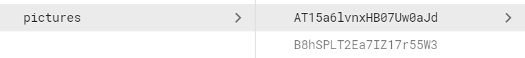
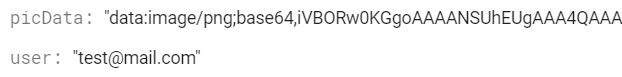

# Mini-Paint React-TypeScript

## [**TASK**](https://mail.google.com/mail/u/0/?zx=y5zceiobh3gg#chat/space/AAAAg3mEYtY)

### How to run the app
First of all you should clone this repository 
(run in your code terminal the command 
`git clone https://github.com/lerarozhentseva/mini-paint.git)`. 
Then run following commands: `npm install` (to install all packages), 
`cd my-app` (to do to the project folder), `npm start`. The project will 
start on http://localhost:3000/

### Database snapshot
* **_Firebase Authenticition_** was used for registration and authorisation. 
* **_Firebase Database_** was used for the pictures.

### Application Stack
* React
* React-router-dom
* Redux 
* Redux-saga
* Firebase
* MUI
* Typescript
* Eslint

### Structure
* src
  * components(folder with components for pages)
  * core(folder with files to Redux)
  * pages (folder contains pages of the app)
